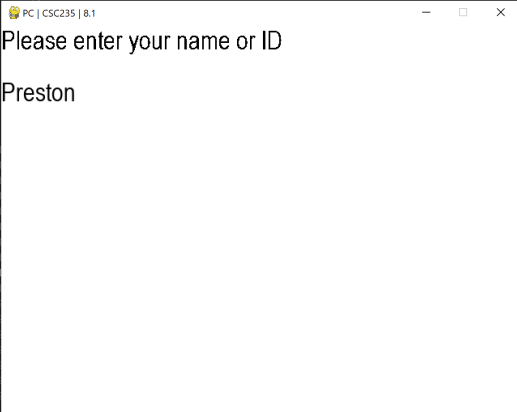
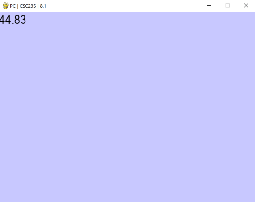
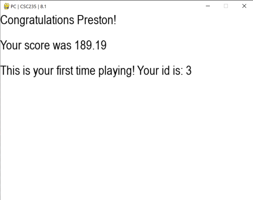
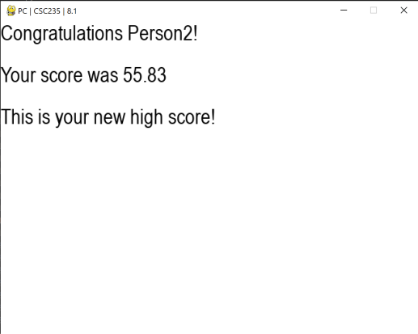

# CSC235-8.1

## About
### Packages Used:
- Pygame: Display window for user information
- sqlite3: Storing user data to a sqlite3 database file
- random: Generating random numbers
## Images
### New user

### Playing

### New user result

### Returning User Result

## Missions:

### Mission part one: Package Hunter
In this mission, your task is to identify and research at least five Python packages that interest you. They can be from any domain: data science, game development, web scraping, or even something totally obscure. Experiment with some packages, there is no need to turn anything in for part 1.

### Mission part two: Package Implementer
Pick one of the packages you researched. Write a simple Python app that uses this package. See if the package does what it advertised. The goal is to get comfortable importing and using a package and verify the package works before writing a full app around it. There is no need to turn anything in for part 2.

### Mission part three: Package Master
Now, take a deep dive into the package you selected. Think of clever ways to use the package(s). Develop a more complex Python program that uses several features of the package(s). You will be turning part 3 in.
